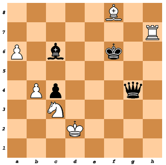

# Situational Chess

## Overview

What is Situational Chess? Situational Chess(SitChess for short), is a chess variant focused on the endgame of chess. I used to compete in chess when I was younger(8-11 years old or so) and have been playing for as long as I can remember. The one thing that I always hated about chess is the heavy focus on the opening & middle parts of the game, and I always felt that the endgame is the most fun part. So I wanted to create a variant of chess that essentially allows you to skip to the end game, with both players having an equal army.  
When I came up with this idea I was playing a lot of: [ Frozen Synapse](http://www.frozensynapse.com/). In that game you play as small squad in a unique simultaneous/turn-based hybrid. Here is a simple screenshot to give you an idea of the game:  

  

There is a style of play in the game where both the map and armies are randomly generated, but it is done so in a balanced fashion. So I took that principle and applied it to chess!

## Starting Army

Each player chooses any combination of pieces that total up to 13 points in piece material. For those who are unaware of piece value, here is each piece with its value:

* Queen = 9 points
* Rook = 5 point
* Bishop = 3 points
* Knight = 3 points
* Pawn = 1 point
* King = 0 Points
  * And no that doesn't mean you can have an infinite number of Kings because: `0 * N = 0`. Nice try, every player has only one King. 

> _Note: I am aware that depending on who you ask that several players debate piece values and if they should be even considered in chess. I am ingoring that here as I needed some basic way to ensure both players have "equal" armies at the start of the game._

Example armies to choose:

* Queen, 1 Knight, and 1 Pawn
* 2 Rooks, and 1 Bishop
* 8 Pawns, and 1 Rook
* etc..

The reason for 13 is to avoid players being to dependant on choosing a queen or two rooks. If for example 15 was the amry value, we would have too many armies like:

* 2 Rooks, 1 Bishop, and 1 Pawn
* 1 Queen, 1 Rook, 1 Pawn
* 5 Pawns, 2 Rooks 

> _Note: If you want to create an artificial handicap for a large skill gap between the two players, the better player can only use less points (11 for example)._

## Using Dice

If you want, you can add an element of randomness to the game by using a six-sided dice to select your army. Essentially keep rolling until your army is totalled to 13 points, a good way to spice up the game. Here are the dice-to-piece conversions: 

* 6 = Queen
* 5 = Rook
* 4 = Bishop
* 3 = Knight
* 2 = Two Pawns
* 1 = Pawn

## Piece Placement

At the start of the game each player takes turns placing one piece where they want as long as they do not go against these following rules:

1. Each piece may not be placed attacking an enemy piece
2. Pawns must be placed atleast two squares from the opposite side of the board
   * This is to avoid a pawn promotion on turn 1
3. You can not place your King into immediate check
   
An example starting position:  

## Misc Rules

Moves you see only in the opening game are not allowed. Since we are starting in the endgame, we assume that these moves would have happened earlier on in the game. The moves which are not allowed are:

1. Casteling
2. En Passant

### Now play Chess!

Seriously, from here just play chess as normal. This is a great way to learn endgame principles, practice tactics, and just overall have a fun way to mix up your chess playing. Enjoy!
