[<- Home](/index.html)  

### My Cube Method

## Disclaimer
This method for solving a cube should be considered an intermediate to advanced method. In this explanation I am assuming you know the basics of solving a cube, so I will be not going into a ton of depth on the details. If you are looking for a tutorial on how to solve for beginners, I recommend the [8355 Method](http://cube.crider.co.uk/beginner.php). The 8355 method uses only one algorithm throughout the entire solve and (the last step was used as inspiration in my method). Also I am not a particually fast solver, and this method is not meant for speed or to replace any of the other methods out there. I simply created this method while having fun experimenting, and came to really enjoy solving with it. Hope you enjoy using it as much as I do.

## Overview
This method can be seen as a hybrid between: [roux](http://grrroux.free.fr/method/Intro.html), [tripod](https://mzrg.com/rubik/methods/tripod/), and [8355](http://cube.crider.co.uk/beginner.php). The reason for this combination of ideas is that I wanted a method that has: a low algorithm count, block building, fun M-Slice moves similar to Roux, easy algorithms (mostly divided into mini-algorithms), and wanted most of the cube solved intuitively(all but the last four corners are solved without algorithms).

### Steps
1. 3x2x1 block
2. Edge Orientation
3. First twol layers minus the Front/Right pair
4. 2x2x1 block oposite of F2L slot(UBL)
   * If two edges are permuted wrong, swap them with an algorithm here
5. Last 4 Corners
   * Permutation
   * Orientation

### Step 1 - 3x2x1 Block
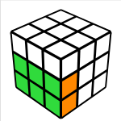  
This step is exactly the same as the first step of the [Roux method](http://grrroux.free.fr/method/Step_1.html). You are free to build anyway you would like, you just have to build a 3x2x1 block on the Down/Left side. I usually use the green/white block and will be using that here orientation for this explanation as well.

### Step 2 - Edge Orientation
  
So this step is probably the most unorthodox and unique step, but I will do my best to break it down. After the 3x2x1 block is completed there are 9 edge pieces left on the cube that need to be solved.  At this stage we can orient them to make the remainder of the solve simpler and more efficient (there can be either: 0, 2, 4, 6, or 8 edges oriented incorrectly). This is accomplished by using a combination of both the Petrus method step of fixing the "bad" edges, and the orientation step of the Roux method's Last Six Edges(LSE).  
Petrus: [Bad Edges](https://lar5.com/cube/fas3.html)  
Roux: [Last Six Edges](http://grrroux.free.fr/method/Step_4.html)  
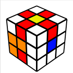  
Using the link above, you can flip the M slice and U layer edges with just these three mini-algorithms:

* M' U2 M'
* M' U M'
* M2

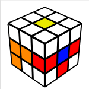  
The three edges shown here I will refer to as the buffer zone, you can store the flipped edges from the M and U moves here. Once they are stored you can solve the other edges using either the above mini-algorithms or you can use Petrus style edges flips. Usually I only need to solve 2 or four with this style, which I usually do with this mimi-algortithm: F' U F  
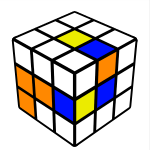 -> 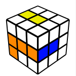  

### Step 3 - F2L -1
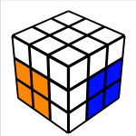  
After we have oriented the remainding edges, the remainder of the cube can be solved with these layers: R, M, and U. If you decide to do either: M, M', r, or r' they need to be followed up with U2 (This keeps the orientation correct, very similar too the Roux method here). So in this step the first two layers are completed minus the Front/Right pair (hence the name F2L -1). Completing this step is rather intuitive and can be accomplished in several ways, I suggest experimenting here to figure out what works best for each solve.

### Step 4a - UBL 2x2x1 Block
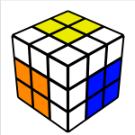  
Here we solve the 2x2x1 block at the Up/Back/Left(UBL) slot. This step is slightly tricky and must be done with only U and R moves due to the edge orientation. Basically to create the block you first create an edge/corner pair and then connect it with the remaining edge. I do this intuitively, here examples of how I solve this step:  

## Edge/Pair
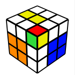 U' R U R' 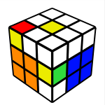 (R U R' U') R U2 R'  U' R U2 R' U2 R U' R'

## 2x2x1 Block
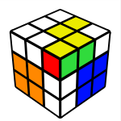 R' U2 R U R' U R  R U2 R' 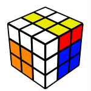 R U R'  

### Step 4b - Edge Flip
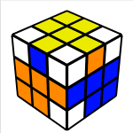  
This step is quite simple, it is possible to end in a position where the two of the final three edges are swapped (almost resembles a parity situation on big cubes). Here is where the only "real" algorithm happens in the entire solve. In order two swap these two edges I do a jb permutation algorithm from the [Fridrich method](http://www.ws.binghamton.edu/fridrich/cube.html):  
( R U R' F' ) ( R U R' U' ) R' F R2 U' R' U'  

* Note: this is the one step of the solve that I don't like, but it works and the algorithm is not too difficult to remember. Also at this step it would be far faster and more efficient to know more algorithms to influence the last two steps.

### Step 5a - Permute Last 4 Corners
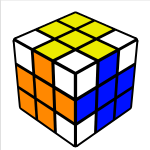  
This is another simple step, it just requires two very simple algorithms that move three corners around. You will most likely have to do cube rotations here and have the corners placed in the top layers as seen in these pictures:  
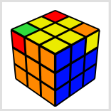( r' F R F' ) ( r U R' U' ) - clockwise  
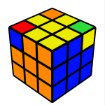 ( r U R' U' ) ( r' F R F' ) - counter clockwise  

### Step 5b - Orient Last 4 Corners
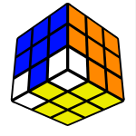  
This step is the most "mathematical", but don't let that scare you. It is actually inspired by the last step of the [8355 method](http://cube.crider.co.uk/beginner.php) which is one of the most simple methods out there. I recommend reading the sections of that method pertaining to solving the last 5 corners. The reason I called this step more "mathematical" is beacuse what we are using here are commutators and conjucates which are two very basic math algorithms to solve parts of the cube. The two algorithms are:

* Commutator: X, Y, X-1, Y-1
* Conjugates: X, Y, X-1

A basic overview of them can be found [here](https://ruwix.com/the-rubiks-cube/commutators-conjugates/).  
For a more in depth look, [here](https://www.ryanheise.com/cube/fundamental_techniques.html).  

In order for us to begin orienting the corners properly, we need to rotate the cube so that the corners needing to be solved are on the bottom. We then use two mini-algorithms in combination with the commuator/conjugate algorithms to flip the corners. Place the corner needing to be rotated in the Down/Front/Right slot and execute either of the algorithms to rotate it. Note that these are just part of the full algorithm, think of them as the basic building blocks for the full algorithm of this step.  
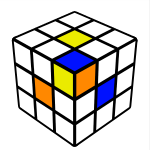 X' ( R U R' U' )x2  
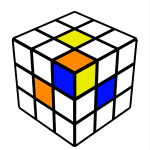 X' ( U R U' R' )x2  

You will either have: 0, 2, 3, 4 incorrect corners that need to be flipped/twisted. Using ommutators/conjugates and the two basic algorithms above, you will piece them all together to solve the corners. I think this step is best illustrated through examples, so here are a few examples showing how to solve this step (each one going up in difficulty):  
 Z2 ( R U R' U' )x2 D ( U R U' R' )x2 D'  
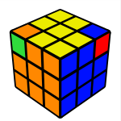 X2 ( U R U' R' )x2 D2 ( R U R' U' )x2 D2  
 Y2 X2 ( U R U' R' )x2 D ( U R U' R' )x2 D ( U R U' R' )x2 D2  
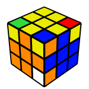 Z Y ( R U R' U )x2 D2 ( U R U' R' )x2 D2 Z' ( R U R' U' )x2 D ( U R U' R' )x2 D'

## Closing Thoughts
Thanks to the software at [ruwix.com](https://ruwix.com/online-rubiks-cube-solver-program/), this was used to create all the images above. This method is never really complete, it's constantly evolving. I have been messing around with it and tinkering with it for some time. If you want to use this method for speed, I would suggest against it, but If you really want to this would be my advice:

* At step 3, finish the F2L with just R and U moves, this will leave just the last layer with the edges oriented.
* Solve the remainding layer with OLL/PLL from [Jessica Fridrich's method](http://www.ws.binghamton.edu/fridrich/cube.html).

It's worth mentioning that when I used to solve focusing on speed I averaged around 20-25 seconds using the Roux method, but honestly I would get way too upset and emotional when solves went wrong. So I decided it was best for me to give it up, and to just have fun with cubing as a hobby. I just happen to be one of those people that can be overly competitve and sometimes it is best for me to avoid competition.
